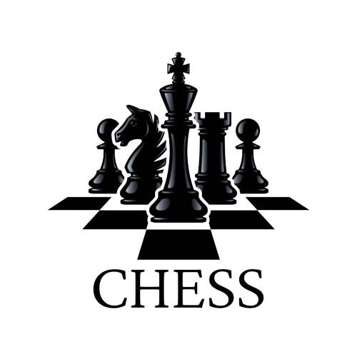

<div align="center">
	<h1>AlphaMax</h1>
   <h4>Chess Game with Chess Engine in C</h4> 
</div>
<div align="center">
   
</div>


## Contents

- [About](#about)
- [Building](#building)
- [Implementation Details](#implementation-details)
- [Computer Player](#computer-player)
- [Problems](#problems)
- [Possible Extension](#possible-extension)

## About
This is Chess Game project that is completely implemented in C Programmng Language .

The Game has 2 modes
  * One player mode, where the player competes with Chess Engine that is implemented using Minimax algorithm and Alpha beta pruning
  * Two player mode, where 2 players can compete with each other.

## Building 

[comment]: <> (For dependencies: )
[comment]: <> (```)
[comment]: <> (sudo apt-get update) 
[comment]: <> (sudo apt-get install lesstif2-dev OR sudo apt-get install libmotif-dev)
[comment]: <> (```)

For compiling:
```
gcc engine.h engine.c main.c -lX11
./a.out
````

## Implementation Details

### Game Loop [Refer](assets/Main.png)
* Input is taken from the White player for his move.
* If  move is valid it makes the move and asks the Black Player to make his move, else it tells the White player about Invalid move and asks for an valid input.
* Same things happen when Black is making his move.
* Game continues till either one of the player wins or there is a draw.

---

### Check Move Algorithm [Refer](assets/Check_Move_is_Move_Feasible.png)
* 1)Examine weather source and destination squares are inside grid, if no INVALID MOVE.
* 2)Then evaluate if source square has current players piece, if no INVALID MOVE.
* 3)Then evaluate if destination square is empty or has opponent players piece, if no INVALID MOVE.
* 4)Now examine if the piece in Source Square can move to Destination Square, if not then its INVALID MOVE.
* 5)If all the above statements are valid then it may be a VALID move, further examination is done by Make Move.

---

### Move Validation Functions [Refer](assets/Check_Move_is_Move_Feasible.png)

| Function  | Description |
| ------------- | ------------- |
| `Validate_Pawn_Move()`  | Examines if it's a valid Pawn Move from given souce to given destination.  |
| `Validate_Rook_Move()`  | Examines if it's a valid Rook Move from given souce to given destination.  |
| `Validate_Knight_Move()` | Examines if it's a valid Knight Move from given souce to given destination.  |
| `Validate_Bishop_Move()`  | Examines if it's a valid Bishop Move from given souce to given destination.  |
| `Validate_Queen_Move()`  | Examines if it's a valid Queen Move from given souce to given destination.  |
| `Validate_King_Move()`  | Examines if it's a valid King Move from given souce to given destination.  |

---
	
### King Safety Functions [Refer](assets/King_Under_Threat_Check.png)
| Function          		| Description                                						|
| -----------------------------| --------------------------------------------------------------------------------------|
| `Is_King_Safe()`  		| Examines if Current player's King is safe after Currrent Player's move.      		|
| `Is_King_under_threat()`   	| Examines if Opponent player's King is under threat after Currrent Player's move.	|

---

### Game Over Functions [Refer](assets/CheckMate.png)
| Function          		| Description                                						|
| -----------------------------| --------------------------------------------------------------------------------------|
| `Checkmate()`   		| Examine if Opponent is Checkmate, if opponent's King is under threat.         	|
| `Stalemate()`   		| Examine if Opponent has at least one Valid Move after Current Player made his move.	|

---

### Make Move Algorithm [Refer](assets/Make_Move.png)
* 1)First we validate the Check Move functions value, if true proceed else INVALID move.
* 2)If Check Move returns true, then we validate if our King is safe after the move, if UNSAFE then INVALID move.
* 3)Then we examine if the opponent's King is under threat, inform the opponent about CHECK.
* 4)If opponent's King was under threat, we examine if opponent's King is Checkmate, GAME OVER.
* 5)ELSE If opponent's King is safe, we examine if opponent is Stalemate, IT IS A DRAW.
* 6)ELSE ask the opponent to make the move.


## Computer Player
* There is a way to update the state of the board and possible moves of the piece for each move made.
The Computer player uses the minmax algorithm, with alpha-beta pruning. 
Minmax uses a static evaluation function. The function has 3 main parameters-

* Values of pieces
* Number of squares controlled
* King safety

* The function uses these parameters to generate a number which represents the *goodness* of the position for white and black. A positive score is good for white, and negative for black. Minmax tries to *minimise* the score for black, and *maximise* the score for white. 
For example, for a depth-2 minmax, (assume white starts)

* White tries ALL moves, and then for each move, calculates all possible moves for black. Now the score for the best move for black, is the score of that *branch*. Now, this is done recursively, with white doing MAX(minimise) ad black doing MIN(maximise)

* Alpha beta pruning eliminates those moves in search using information about best move for black or white till that point.

* The algorithm works fairly fast upto depth 4, but takes more than 1.5 minutes for depth 6. Odd depths are unreliable, as do not end with opponent's move.


## Problems

* This does NOT implement *En-Passe*, due to complications arising out of using en-passe to kill a checking pawn, due to the final square not being the same as the square of the piece which is killed


## Possible Extension:

* Build a better static evaluation function by anylisis of board position<-> win data

* Interface with Xboard

* Some kind of lookup table for fast checking of draw by repetition of *position*

* Variable tree depth- when situation is dynamic(king in check or exchange going on) , look ahead more (modify the code in if (depth == 0))
